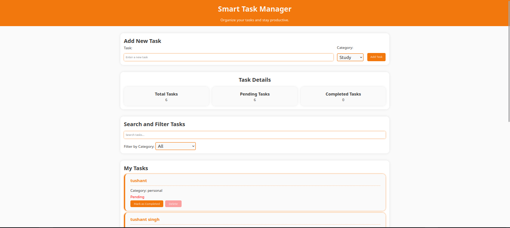

# Smart Task Manager

## Project Description

The Smart Task Manager is a web application built using HTML, CSS, and JavaScript. It helps users add, organize, search, filter, complete, and delete tasks.

## Features

- Add tasks
- Select task categories
- Validate empty input
- Display tasks dynamically
- Mark tasks as completed or pending
- Delete tasks
- Search tasks
- Filter tasks by category
- Display total, pending, and completed task counts
- Save tasks using localStorage

## Technologies Used

- HTML5
- CSS3
- JavaScript
- DOM manipulation
- Event listeners
- Arrays and objects
- localStorage

## Screenshot

## How to Run

1. Download or extract the project folder.
2. Open `index.html` in a browser.
3. Add and manage tasks using the interface.

## Learning Reflection

in this Project i have learnt some things.

First will be the Search and filter. This is the first time i add this feature in an Project. So for some guidence i asked ai for some help. It's a new learning for me i understand how to add this feature and surely i am going to add this feature in my more Project for practice purpose ofcourse.

a Good thing is i am getting comfortable with array,creating Element, localStorage and making button more interactive this time the will pop back so pressing them feels fun.

Input Fields i tried to make them look as profesonal and give them a nice orange shadow. and one important thing is dropdown menu this is the first time i apply styles to them.

I also learnt how to connect HTML, CSS and JavaScript together in one project. At first, managing different sections and making everything work together felt a little confusing, but slowly I started understanding the process. I learnt how to take the value from an input field and use it in JavaScript. I also learnt how to update the webpage whenever something changes.

One challenge was updating the task counters when a task was completed or deleted. I solved this by using a render function, which displays the tasks again whenever the data changes. I also learnt that localStorage needs JSON.stringify() when saving data and JSON.parse() when getting it back.

Overall, this project gave me more confidence because I was able to build something interactive instead of only writing small practice programs. I still need more practice, but now I understand the basic working of a task manager much better.

## Future Improvements

- Add task editing
- Add due dates
- Add task priorities
- Add dark mode
- Add sorting options